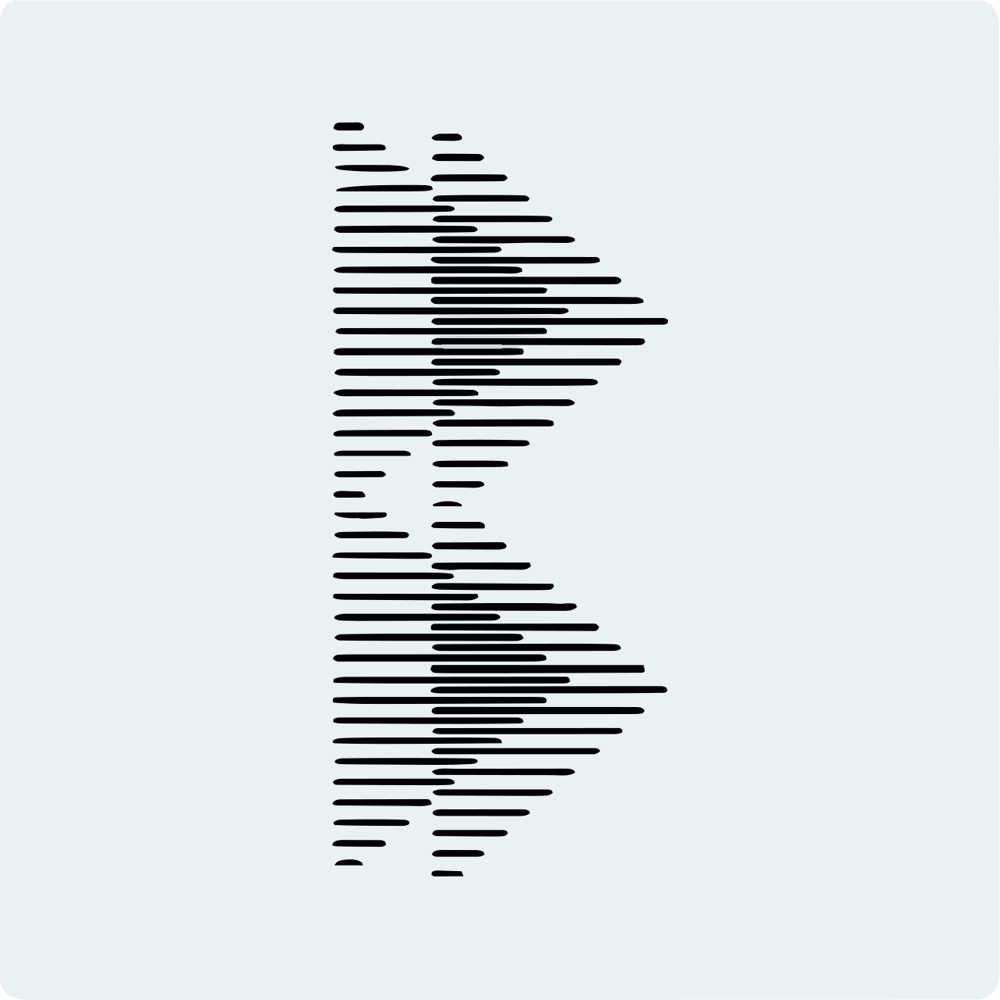

# MiniSpring 📱
<!-- PROJECT LOGO -->
 

  
   

  <!-- ABOUT THE PROJECT -->
## About The Project
We made a mobile version only for view borad cards [for now] 
Here's why:
* Your time should be focused on monitoring something ex. Cards or dashboards continuously As project that's solves a problem and helps others to be connected.
* You shouldn't be doing the same tasks over and over like creating or adding and modifying any data through mobile devices.
### Built With
MVVM same as Spring version but this time with MAUI framework.  

  
